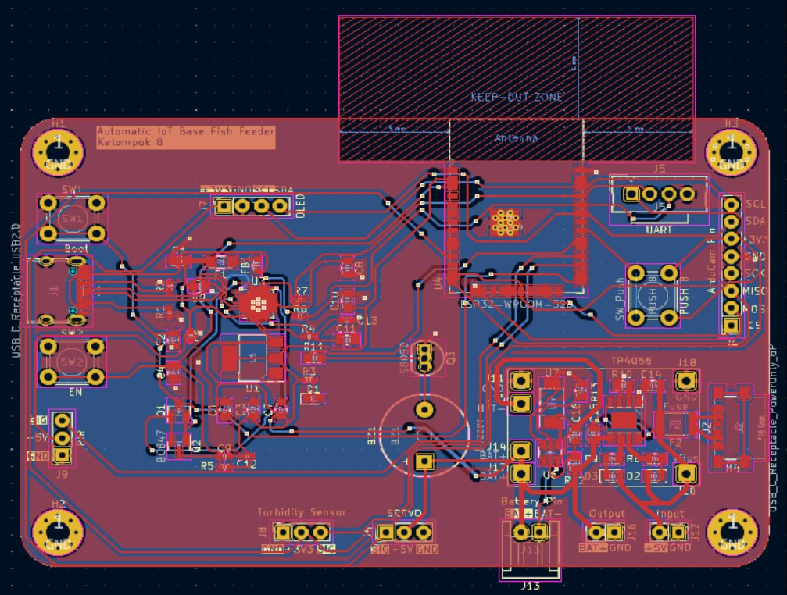
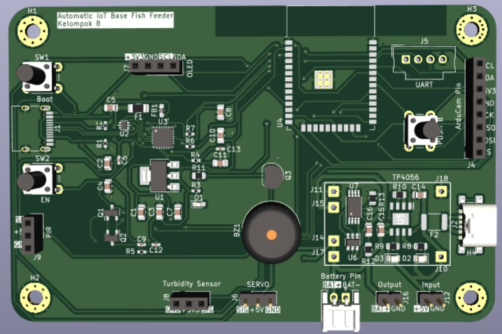

# IoT-Based Automatic Fish Feeder System 🐟

An **IoT-integrated automatic fish feeder** designed using **ESP32** and **KiCad PCB design** to optimize aquarium maintenance.  
This project was developed as part of the *Final Project RE 2* course at Universitas Indonesia (2023).

---

## 🧠 Overview
This system enables automated and remote control of fish feeding using IoT technology.  
With motion and turbidity sensors, the feeder intelligently manages feeding schedules, monitors water conditions, and communicates through a **web server** via **Wi-Fi**.

**Key features:**
- Remote feeding schedule control via web interface  
- Real-time water turbidity monitoring  
- OLED/LCD display showing feeding status and last feeding time  
- Owner confirmation before auto-feeding for security  
- Deep sleep mode for efficient power usage  

---

## ⚙️ Hardware Summary
- **Microcontroller:** ESP32  
- **Sensors:** PIR (motion) sensor, turbidity sensor  
- **Actuators:** Servo motor (feeding mechanism), buzzer  
- **Display:** OLED / LCD  
- **Power System:** TP4056 Li-Ion charger module, 3.7V Li-ion battery  
- **Interfaces:** UART, USB Type-C (CP2104), Wi-Fi (Web Server)  

---

## 🧩 PCB Design
The PCB was designed using **KiCad** with:
- Dual-layer copper traces (signal + ground)  
- Ground filling for noise reduction and EMI suppression  
- Proper antenna clearance for ESP32 Wi-Fi module  
- Mounting holes for mechanical stability  
- Compact design for integration inside an aquarium enclosure  

---

## 🧰 Components Used
| Category | Components |
|-----------|-------------|
| Microcontroller | ESP32 |
| Sensors | PIR, Turbidity Sensor |
| Display | OLED/LCD |
| Actuators | Servo Motor, Buzzer |
| Power | TP4056, Li-ion Battery |
| Communication | CP2104 USB to UART, Wi-Fi |

---

## 📐 PCB Layout (Example)  

---

## 🧾 Author & Contribution
**Team 8 – Final Project RE 2 (Universitas Indonesia, 2023)**  
- **M. Akmal Prabowo** – Schematic & PCB Design, Report (Results & Discussion)  
- **M. Daffa Zainal** – Schematic Documentation  
- **Salman Hakim Kurnia** – Feature & Component Design, Ideation, Video Editing  

---

## 📚 Reference
Full report: *Final Project RE 2 – IoT-Based Automatic Fish Feeder System (Universitas Indonesia, 2023)*  
YouTube Demo: [https://www.youtube.com/watch?v=FHcyZINsoDI](https://www.youtube.com/watch?v=FHcyZINsoDI)

---

## 📜 License
This project is for **educational and personal portfolio use only**.  
Commercial reproduction or redistribution is not permitted.
